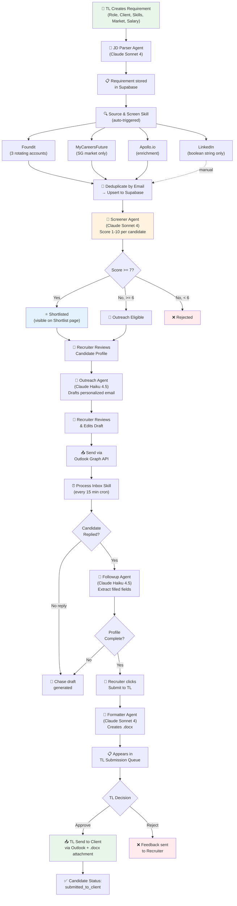
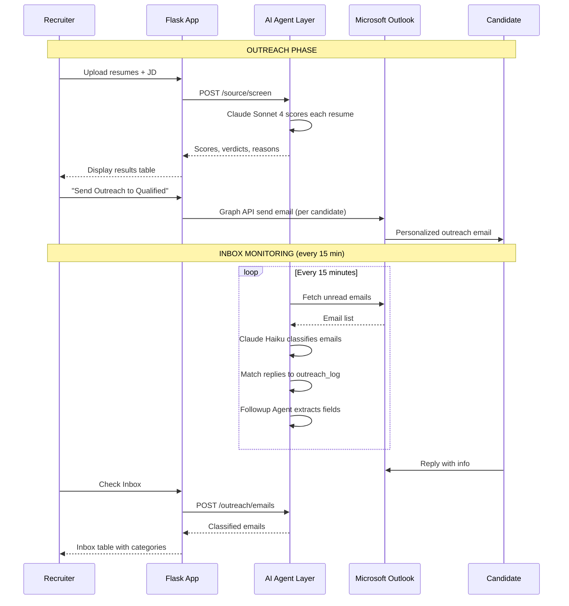
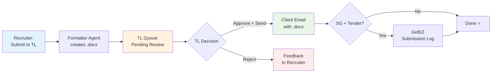
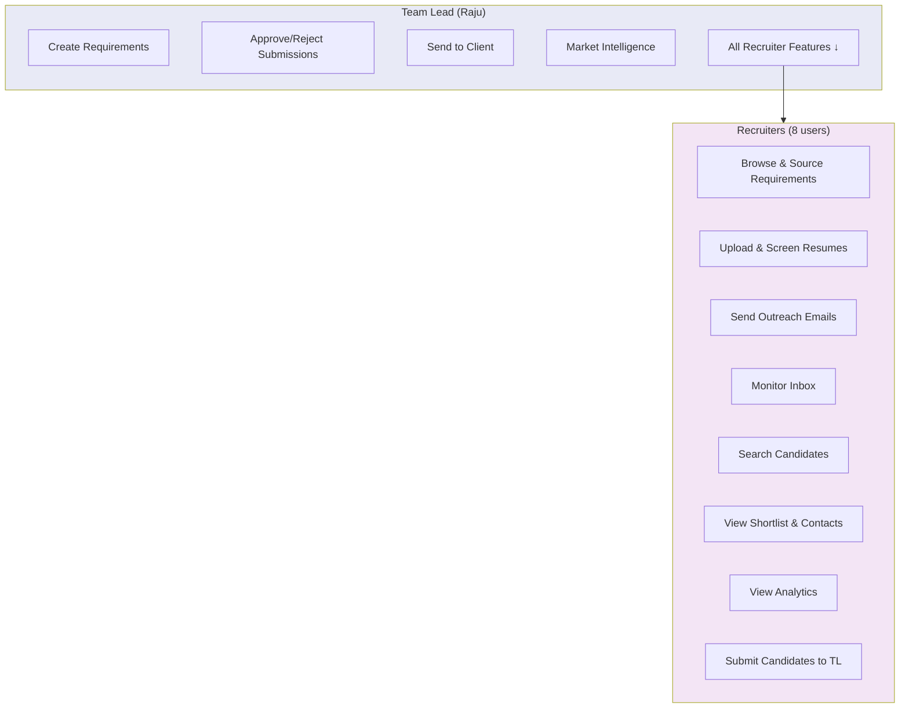
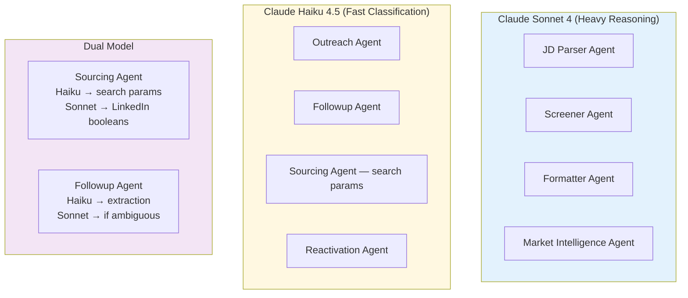

# ExcelTech Recruitment Agent — Visual Workflows

## Master Recruitment Pipeline

---

## Outreach & Inbox Flow

---

## Submission & Approval Flow

---

## Role-Based Access

---

## AI Agent Routing

